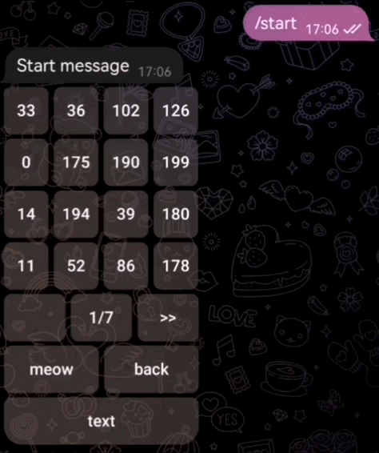

# List view using Inline buttons aiogram3

## Preview

## Usage

### Basic
``` python
data_list1 = random.sample(range(200), 101)    # example: data_list1 = ['foo', 'bar', 'foobar']

lv = SimpleListView(
    data_list=data_list1,    # data
    rows=5,                  # buttons per row
    columns=5,               # buttons per column
    action='handle_lv'       # custom callback action
)


@dp.message(Command(commands=['start']))    # start command
async def start(message: Message):
    await message.answer('Start message', reply_markup = await lv.start_lv())


@dp.callback_query(LV_CallBack.filter())    # listview callback
async def lv_callback(
        callback: CallbackQuery,
        callback_data: LV_CallBack
):
    if callback_data.action == 'handle_lv':
        index = await lv.process_selection(callback, callback_data)

        if index is not None:
            await callback.message.answer(f'index: {index} | item: {data_list1[index]}')

    await callback.answer()


```
---
### With buttons
``` python
data_list1 = random.sample(range(200), 101)

buttons = {                 # 'text' : 'action'
    'meow': 'send_meow',
    'text': 'test'
}

lv = SimpleListView(
    data_list=data_list1,
    rows=5,
    columns=5,
    action='handle_lv',
    buttons=buttons,
    btns_per_row=2
)


@dp.message(Command(commands=['start']))    # start command
async def start(message: Message):
    await message.answer('Start message', reply_markup = await lv.start_lv())


@dp.callback_query(LV_CallBack.filter())    # listview callback
async def lv_callback(
        callback: CallbackQuery,
        callback_data: LV_CallBack
):
    if callback_data.action == 'handle_lv':
        index = await lv.process_selection(callback, callback_data)

        if index is not None:
            await callback.message.answer(f'index: {index} | item: {data_list1[index]}')

        # handle extra buttons
        if callback_data.extra_act == 'send_meow':
            await callback.message.answer('meow')

        if callback_data.extra_act == 'test':
            await callback.message.answer('❤️')

    await callback.answer()
```
---
### Multiple
``` python
data_list1 = random.sample(range(200), 101)
data_list2 = random.sample(range(200), 101)

lv = SimpleListView(
    data_list=data_list1,
    rows=5,
    columns=5,
    action='handle_lv'
)

lv2 = SimpleListView(
    data_list=data_list2,
    rows=6,
    columns=5,
    action='handle_lv2'
)


@dp.message(Command(commands=['start']))    # start command
async def start(message: Message):
    await message.answer('First', reply_markup = await lv.start_lv())

@dp.message(Command(commands=['lv2']))    # 2-nd list view command
async def start(message: Message):
    await message.answer('Second', reply_markup = await lv2.start_lv())


@dp.callback_query(LV_CallBack.filter())    # listview callback
async def lv_callback(
        callback: CallbackQuery,
        callback_data: LV_CallBack
):
    if callback_data.action == 'handle_lv':
        index = await lv.process_selection(callback, callback_data)

        if index is not None:
            await callback.message.answer(f'index: {index} | item: {data_list1[index]}')

    if callback_data.action == 'handle_lv2':
        index = await lv2.process_selection(callback, callback_data)

        if index is not None:
            await callback.message.answer(f'index: {index} | item: {data_list2[index]}')

    await callback.answer()

```
